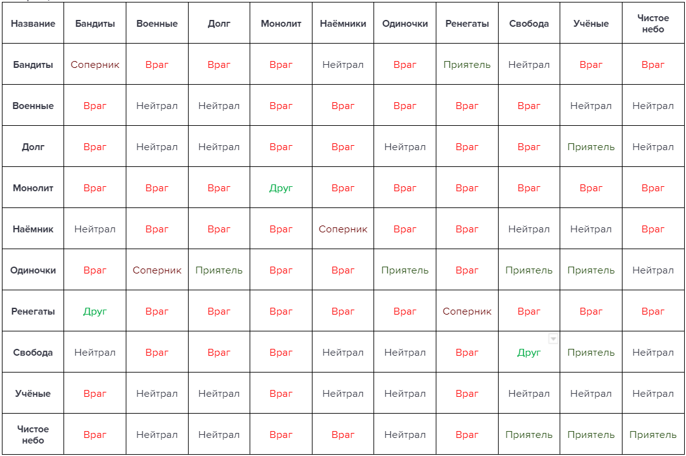

## Матрица отношений

> Терпение и смирение нужно иметь и для мира и для войны.
>
> — Иоанн Дамаскин

Отношения между группировками в мире зоны строятся, в основном на взаимовыгоде. Сегодня "Долг" и "Свобода" могут заключить перемирие на станции "Янов", а завтра продолжат убивать друг друга из-за контроля над секторами. Невозможно показать всю глубину и хитросплетения взаимоотношений в зоне меж всеми её обитателями, однако можно зафиксировать некое "статус-кво" в виде схемы-матрицы, где показазываются отношения между фракциями.

Всего можно выделить 5 уровней отношений (от худшего к лучшему):
1. Враг. 
2. Соперник.
3. Нейтрал.
4. Приятель.
5. Друг.

Необходимо также понимать, что отношения внутри группировки тоже учитываются в матрице. Ренегаты, например, на дух не переносят друг друга и готовы "продать" товарища в любой им выгодный момент. 

{: .important-title }
> Динамические отношения
>
> В вашей игре отношения между группировками могут меняться из-за перемирий, новых войн и новых союзов.
> В этом случае имеет смысл использовать матрицу для справки или напоминания о том, "с чего всё начиналось".

### Матрица

